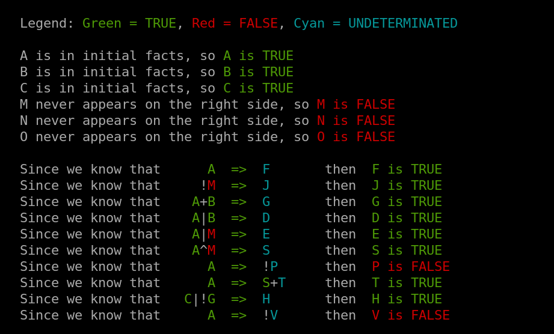

# Expert System - School 42 project


## Introduction

This project is part of the curriculum at 42 and aims to implement an expert system in **C++** capable of reasoning based on given facts and rules. The system follows a logical evaluation using propositional logic operators.

## Features

- Parses a set of rules and facts from an input file with the following format:

  ```
  C          =>  E
  A + B + C  =>  D
  A | B      =>  C
  A + !B     =>  F
  C | !G     =>  H
  V ^ W      =>  X
  A + B      =>  Y + Z
  C | D      =>  X | V
  E + F      =>  !V
  A          =>  !(B ^ C) + D
  A + B      <=> C

  =ABG  # Initial Facts

  ?GVX  # Queries
  ```

- Evaluates logical expressions using:

  - `!` (NOT)
  - `+` (AND)
  - `#` (OR)
  - `^` (XOR)
  - `(` and `)` for grouping expressions

- **AND**, **OR**, **XOR** and **Parentheses in Conclusions**
- **Biconditional Rules:** For example, "`A and B if-and-only-if D`".
- Determines the truth value of a given query
- Handles contradictions
- **Interactive Fact Validation:** The user can change facts to check the same query against different inputs.
- **Reasoning Visualization:** Provides feedback to explain the answer.
  For instance: "`We know that A is true. Since we know A | B => C, then C is true`".



## Installation

```bash
git clone https://github.com/fleuryD/42-expert-system.git
cd 42_expert_system
make
```

## Usage

```bash
./expert ./maps/02.txt	# Open a file (expert.exe on Windows)
./expert -f [id]	# or open a file with the assistant (expert.exe on Windows)

-i abcd		# Define the InitialFacts
```

## Requirements

- Linux or Windows
- C++23 or later
- A compiler such as `g++`

## Authors

Developed by dFleury as part of the 42 school curriculum.
